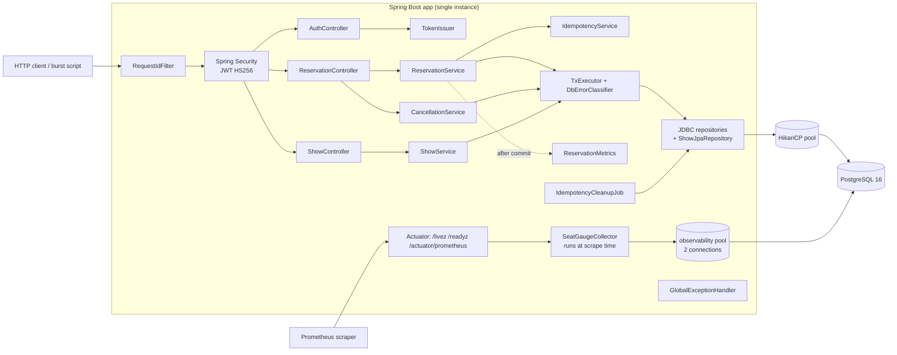
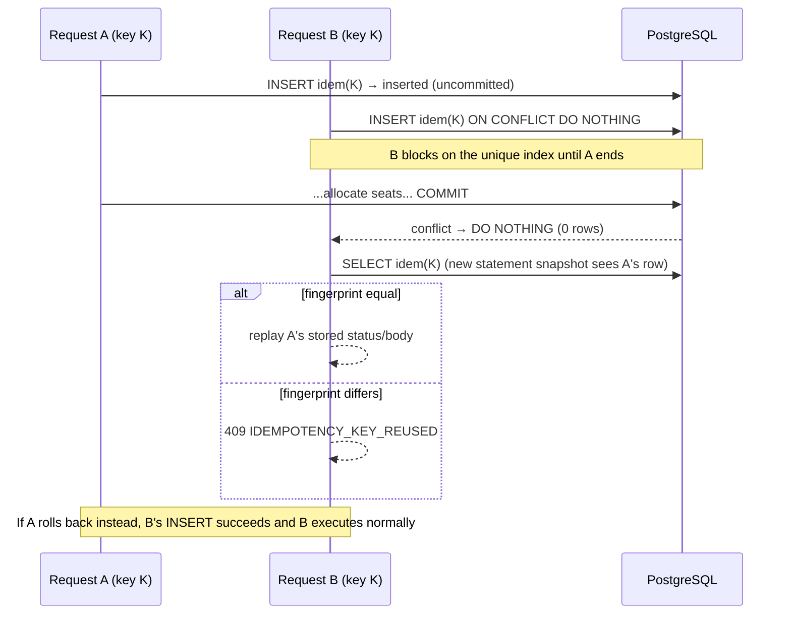
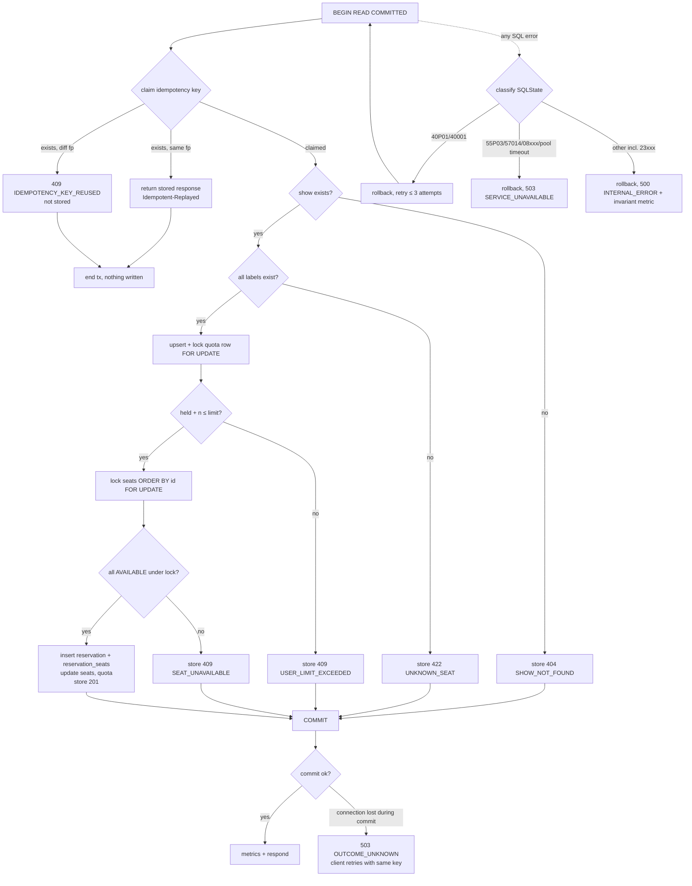
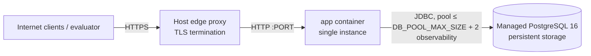

# 01 — Architecture

## 1. Mandatory technology stack

| Concern | Choice | Notes |
|---|---|---|
| Language | Java 21 (LTS) | Records, sealed interfaces, pattern-matching `switch`, virtual threads |
| Framework | Spring Boot **3.5.16** (the latest 3.5 patch at implementation time) | Spring Boot 3.x is mandated |
| Web | Spring Web MVC (embedded Tomcat) | `spring.threads.virtual.enabled=true` |
| Persistence | Spring Data JPA / Hibernate 6 (`shows` table only) + `NamedParameterJdbcTemplate` (all concurrency-critical SQL) | One `JpaTransactionManager`; JDBC participates in the same transaction |
| Database | PostgreSQL **16** (15+ compatible) | Source of truth |
| Migrations | Flyway (`flyway-core` + `flyway-database-postgresql`) | Runs at application startup |
| Validation | Jakarta Bean Validation (Hibernate Validator) | `spring-boot-starter-validation` |
| Security | Spring Security 6 + `spring-boot-starter-oauth2-resource-server` (Nimbus JOSE, HS256) | No extra JWT library |
| Metrics | Micrometer + `micrometer-registry-prometheus` | Via Actuator |
| Logging | Logback + Spring Boot built-in structured logging (`logging.structured.format.console=ecs`, available since Boot 3.4) | No extra encoder dependency |
| Testing | JUnit 5, Spring Boot Test, Spring Security Test, Testcontainers (`postgresql`, `junit-jupiter`), `spring-boot-testcontainers` (`@ServiceConnection`) | Docker required for `verify` |
| Build | Maven **3.9.16** via Maven Wrapper (`./mvnw`, `distributionType=only-script`, so no wrapper jar is committed) | Surefire runs unit tests (`*Test`); Failsafe runs integration tests (`*IT`) |
| Container | Docker multi-stage build: `eclipse-temurin:21-jdk` → `eclipse-temurin:21-jre` | Pinned by tag and digest (§1.1) |
| Local orchestration | Docker Compose v2 | `postgres:16-alpine`, pinned by digest (§1.1) |
| Hosting | Render (primary recommendation) | See `07` |

### 1.1 Dependency versions policy

The versions below were resolved at implementation time and are now pinned in `pom.xml`,
`.mvn/wrapper/maven-wrapper.properties`, `Dockerfile` and `docker-compose.yml`:

- Spring Boot parent **3.5.16**, Java 21, Maven Wrapper **3.9.16**.
- `eclipse-temurin:21-jdk@sha256:3e3c176ffed168beb42c607be9bc1639b466cf00261a0fb04425562c9d0c5c2b`
- `eclipse-temurin:21-jre@sha256:cff19e6215689161eb6162c11b86b0c60ddf802164f2eaf48d570f8fb79a36c5`
- `postgres:16-alpine@sha256:721873c34ceb9f8d8fc265984940dc982404c105f19ad51be9fdc5970a6080ea`

Spring Initializr no longer offers a 3.x line, so the parent is pinned by hand rather than generated
(risk R-10 realised, with no impact beyond this note). The rules that still apply:

1. Keep the parent version explicit and in the 3.5.x line.
2. Let the Spring Boot BOM manage **all** library versions (Spring, Hibernate, HikariCP, PostgreSQL
   JDBC, Flyway, Micrometer, Jackson, Logback, JUnit, Testcontainers). Do not override a BOM-managed
   version unless a CVE requires it, and record any override in the decision log.
3. No version ranges anywhere, and Docker base images stay pinned by digest.
4. Record the resolved versions (`./mvnw -q dependency:tree`) in `WRITEUP.md`.

### 1.2 Maven dependencies (exact artifact list)

```xml
<parent>
  <groupId>org.springframework.boot</groupId>
  <artifactId>spring-boot-starter-parent</artifactId>
  <version>3.5.16</version>
</parent>

<properties><java.version>21</java.version></properties>

<dependencies>
  <dependency><groupId>org.springframework.boot</groupId><artifactId>spring-boot-starter-web</artifactId></dependency>
  <dependency><groupId>org.springframework.boot</groupId><artifactId>spring-boot-starter-validation</artifactId></dependency>
  <dependency><groupId>org.springframework.boot</groupId><artifactId>spring-boot-starter-data-jpa</artifactId></dependency>
  <dependency><groupId>org.springframework.boot</groupId><artifactId>spring-boot-starter-security</artifactId></dependency>
  <dependency><groupId>org.springframework.boot</groupId><artifactId>spring-boot-starter-oauth2-resource-server</artifactId></dependency>
  <dependency><groupId>org.springframework.boot</groupId><artifactId>spring-boot-starter-actuator</artifactId></dependency>
  <dependency><groupId>io.micrometer</groupId><artifactId>micrometer-registry-prometheus</artifactId></dependency>
  <dependency><groupId>org.flywaydb</groupId><artifactId>flyway-core</artifactId></dependency>
  <dependency><groupId>org.flywaydb</groupId><artifactId>flyway-database-postgresql</artifactId></dependency>
  <dependency><groupId>org.postgresql</groupId><artifactId>postgresql</artifactId><scope>runtime</scope></dependency>

  <dependency><groupId>org.springframework.boot</groupId><artifactId>spring-boot-starter-test</artifactId><scope>test</scope></dependency>
  <dependency><groupId>org.springframework.security</groupId><artifactId>spring-security-test</artifactId><scope>test</scope></dependency>
  <dependency><groupId>org.springframework.boot</groupId><artifactId>spring-boot-testcontainers</artifactId><scope>test</scope></dependency>
  <dependency><groupId>org.testcontainers</groupId><artifactId>junit-jupiter</artifactId><scope>test</scope></dependency>
  <dependency><groupId>org.testcontainers</groupId><artifactId>postgresql</artifactId><scope>test</scope></dependency>
</dependencies>
```

Build plugins: `spring-boot-maven-plugin`, `maven-surefire-plugin` (`**/*Test.java`),
`maven-failsafe-plugin` (`**/*IT.java`, goals `integration-test` + `verify`). No Lombok.

## 2. Package structure

Base package `com.seatres`, Maven `groupId=com.seatres`, `artifactId=seat-reservation-service`.

```
src/main/java/com/seatres/
├── SeatReservationApplication.java
├── config/
│   ├── AppProperties.java            # @ConfigurationProperties("app"): auth.jwtSecret, auth.adminKey, idempotency.retention
│   ├── ObservabilityDataSourceConfig.java  # second, tiny Hikari pool (2 connections) used only by SeatGaugeCollector (ADR-023)
│   ├── JacksonConfig.java            # strict ObjectMapper: unknown fields, float→int and scalar coercion rejected
│   ├── SchedulingConfig.java         # @EnableScheduling (idempotency cleanup)
│   └── StartupChecks.java            # fail fast: JWT secret and admin key ≥ 32 bytes and different
│                                      # from each other; prod refuses their dev defaults; retention ≥ PT24H
├── security/
│   ├── SecurityConfig.java           # SecurityFilterChain, endpoint authorization rules
│   ├── JwtConfig.java                # NimbusJwtDecoder (HS256) + validators (iss, aud, exp, sub pattern)
│   ├── TokenIssuer.java              # NimbusJwtEncoder (HS256): signs demo tokens for POST /auth/token (ADR-021)
│   ├── RolesClaimConverter.java      # "roles" claim → ROLE_USER / ROLE_ADMIN
│   ├── ProblemResponseWriter.java    # writes problem+json from inside the filter chain
│   ├── ProblemAuthenticationEntryPoint.java   # 401 as Problem Details
│   └── ProblemAccessDeniedHandler.java        # 403 as Problem Details
├── web/
│   ├── AuthController.java           # POST /auth/token (demo token endpoint; ADMIN gated by X-Admin-Key)
│   ├── ShowController.java           # POST /shows, GET /shows/{id}
│   ├── ReservationController.java    # POST /shows/{id}/reserve, POST /reservations/{id}/cancel
│   ├── RequestIdFilter.java          # X-Request-Id → MDC + response header (highest precedence)
│   └── dto/                          # CreateShowRequest, RowSpec, ShowResponse, ShowDetailsResponse,
│                                     # SeatView, SeatCounts, ReserveRequest, ReservationResponse, ReservedSeat,
│                                     # TokenRequest, TokenResponse, and the cross-field constraints
│                                     # @ValidCreateShow and @UniqueLabels with their validators
├── service/
│   ├── ShowService.java              # create show, read show
│   ├── ReservationService.java       # reserve transaction (04 §4)
│   ├── CancellationService.java      # cancel transaction (04 §6)
│   ├── IdempotencyService.java       # claim / lookup / finalize inside the caller's transaction
│   ├── RequestFingerprinter.java     # canonical form + SHA-256
│   └── tx/
│       ├── TxExecutor.java           # programmatic tx: begin/callback/commit, retry 40P01/40001, commit-phase
│       │                             # detection, rollback-only, after-commit hooks
│       ├── DbErrorClassifier.java    # SQLState → {RETRYABLE, BUSY, UNAVAILABLE, BUG}
│       └── Tx.java                   # requireActive(): guards repository writes and FOR UPDATE reads
├── repository/
│   ├── ShowJpaRepository.java        # Spring Data JPA for ShowEntity
│   ├── SeatJdbcRepository.java       # batch insert, resolve, lock, confirm, release, list by show, counts
│   ├── ReservationJdbcRepository.java
│   ├── QuotaJdbcRepository.java      # upsert + lock + adjust user_show_quotas
│   └── IdempotencyJdbcRepository.java
├── domain/
│   ├── ShowEntity.java               # JPA entity for table shows
│   ├── SeatStatus.java               # enum AVAILABLE, HELD, CONFIRMED
│   ├── ReservationStatus.java        # enum CONFIRMED, CANCELLED
│   ├── SeatRow.java                  # record(id, label, status, pricePaise)
│   ├── ReserveCommand.java           # record(showId, userId, labels(sorted), idemKey, fingerprint)
│   └── ReserveOutcome.java           # sealed: Confirmed | Declined | Replayed
├── error/
│   ├── ErrorCode.java                # enum: code, HTTP status, title, type URI, retryable
│   ├── ApiException.java             # base runtime exception carrying ErrorCode + extension properties
│   ├── Problems.java                 # builds ProblemDetail with code/requestId/retryable
│   ├── (ShowNotFoundException, ReservationNotFoundException, IdempotencyKeyReusedException,
│   │    ServiceUnavailableException, OutcomeUnknownException)
│   └── GlobalExceptionHandler.java   # @RestControllerAdvice extending ResponseEntityExceptionHandler,
│                                     # so Boot's own problem handler backs off → application/problem+json
├── observability/
│   ├── ReservationMetrics.java       # custom meters (05 §4); increments only after commit
│   ├── SeatGaugeCollector.java       # scrape-time collector: seatres_seats{show_id,status} for the 20 newest shows (ADR-023)
│   └── LogRefs.java                  # userRef / idemKeyRef hashing for logs
└── jobs/
    └── IdempotencyCleanupJob.java    # @Scheduled(fixedDelay = 15 min) delete expired idempotency records

src/main/resources/
├── application.yml                   # all env placeholders (07 §3)
├── application-local.yml             # dev-only JWT secret
├── application-prod.yml              # strict settings
└── db/migration/V1__baseline_schema.sql

src/test/java/com/seatres/...         # *Test (unit), *IT (Testcontainers); support/ holds TestTokens,
                                      # Api (HTTP helper), Reconciliation (R1–R7 SQL from 03 §7.3)
scripts/
├── BurstTest.java                    # single-file Java 21 burst script (06 §7)
└── MintToken.java                    # single-file HS256 token minter (06 §7.6)
```

Rules:

- Controllers handle HTTP mapping and validation only: no SQL, no transactions.
- Services own transaction boundaries (through `TxExecutor`) and business decisions.
- Repositories contain SQL only. They never start transactions and never decide HTTP status.
- Domain declines are values (`ReserveOutcome.Declined`), not exceptions from SQL.
- `observability` is the only package that registers custom meters.
- Identity reaches a controller as `@AuthenticationPrincipal Jwt`, and only `jwt.getSubject()` is
  used. No `CurrentUser` type exists, because nothing needs the roles once authorization has run.

## 3. Component responsibilities



| Component | Responsibility | Must not |
|---|---|---|
| `RequestIdFilter` | Accept/generate `X-Request-Id`, put it in MDC, echo it in the response | Trust arbitrary header content (validate `^[A-Za-z0-9-]{8,64}$`) |
| `SecurityConfig` | Authentication and authorization per endpoint; `POST /auth/token` is public. The problem entry point and access-denied handler are set **both** on `exceptionHandling` and inside `oauth2ResourceServer`, because the bearer filter uses its own and would otherwise answer an invalid token with an empty 401 body | Read identity from the body |
| `AuthController` + `TokenIssuer` | Issue HS256 demo tokens; require a matching `X-Admin-Key` for role `ADMIN` | Store tokens; log tokens or the admin key; compare the admin key with `equals` (use constant-time `MessageDigest.isEqual`) |
| Controllers | Bind + validate DTOs, read `Idempotency-Key`, call services, set status/headers | Contain business logic |
| `ReservationService` | Execute the reserve transaction (04 §4) and return a `ReserveOutcome` | Use COUNT-then-insert or in-memory locks |
| `CancellationService` | Execute the cancel transaction (04 §6) | Release seats the reservation doesn't own |
| `IdempotencyService` | Claim the key, detect reuse, store/replay the outcome **inside the caller's tx** | Open its own transaction |
| `TxExecutor` | Transaction boundaries, retry policy, commit-phase failure detection | Retry business declines |
| `DbErrorClassifier` | SQLState → category | Map DB errors to 409 |
| `GlobalExceptionHandler` | Exceptions → Problem Details | Leak SQL or stack traces |
| `ReservationMetrics` | Counters | Use unbounded labels |
| `SeatGaugeCollector` | Read seat counts per show at scrape time over the observability pool | Use the main pool (it would queue behind a burst); track more than 20 shows |
| `IdempotencyCleanupJob` | Delete expired records in batches | Delete unexpired records |

## 4. Request lifecycles

Common prefix for every request: `RequestIdFilter` → Spring Security (`BearerTokenAuthenticationFilter`
verifies signature/alg/iss/aud/exp and maps roles) → authorization rule → `DispatcherServlet` →
controller. Any exception goes to `GlobalExceptionHandler` (or to the security entry point /
access-denied handler for 401/403) and becomes `application/problem+json` with `code` and
`requestId`.

### 4.1 `POST /shows` (ADMIN)

1. Authorize `ROLE_ADMIN`.
2. Bind `CreateShowRequest` with strict Jackson. Run Bean Validation (02 §5.1) and cross-field checks
   (unique rows, total seats ≤ 10,000).
3. `ShowService.create` → `TxExecutor.execute`:
   1. Persist `ShowEntity` (JPA) and `flush()`.
   2. Batch insert seats (JDBC, batches of 1,000) in row order.
   3. Commit.
4. Respond 201 with `Location: /shows/{id}`.

### 4.2 `GET /shows/{id}` (USER or ADMIN)

1. Parse the UUID (400 if malformed).
2. Load `ShowEntity` (404 if absent).
3. Run one statement: `SELECT id, label, status, price_paise FROM seats WHERE show_id = ? ORDER BY id`.
   Counts are derived in memory from that single snapshot, so
   `total = available + held + confirmed` always holds in the response. (`id` is selected because the
   same `SeatRow` record serves the reserve path's locking read; it is not exposed in the response.)
4. Respond 200.

### 4.3 `POST /shows/{id}/reserve` (USER)

1. Authorize `ROLE_USER`.
2. Bind and validate `ReserveRequest` (1–10 unique labels matching the pattern), then require
   `Idempotency-Key` (400 `IDEMPOTENCY_KEY_MISSING` or `IDEMPOTENCY_KEY_INVALID`). Spring resolves
   and validates handler arguments before the method body runs, so a request that is wrong in both
   the body and the key reports `VALIDATION_FAILED` first.
3. Build a `ReserveCommand` with sorted labels and the fingerprint (03 §6).
4. `ReservationService.reserve` → `TxExecutor.execute` (retry on 40P01/40001, max 3 attempts) → the
   reserve transaction in `04` §4 → `ReserveOutcome`:
   - `Confirmed(body)` → 201.
   - `Declined(status, problemBody)` → 404/409/422 with the stored problem body.
   - `Replayed(status, body)` → stored status and body + `Idempotent-Replayed: true`.
   - Key reuse → `IdempotencyKeyReusedException` → 409 (not stored).
5. After commit: metrics per `05` §5.

### 4.4 `POST /reservations/{id}/cancel` (USER, owner)

1. Authorize `ROLE_USER`. Parse the UUID.
2. `CancellationService.cancel(reservationId, userId)` → `TxExecutor.execute` → the cancel transaction
   in `04` §6.
3. Respond 200 with the reservation in `CANCELLED` status, whether this call cancelled it or it was
   already cancelled. Respond 404 if it is missing or not owned.

### 4.5 Probes and metrics

- `/livez` → liveness group (`livenessState` only). It never touches the DB.
- `/readyz` → readiness group (`readinessState`, `db`). DOWN → 503.
- `/actuator/prometheus` → Prometheus text format, public (05 §3). Each scrape runs one seat-count
  query on the observability pool (ADR-023).

### 4.6 `POST /auth/token` (public)

1. Bind and validate the body (`sub` pattern, `roles` ⊆ `USER`/`ADMIN`, default `["USER"]`).
2. If `ADMIN` is requested, compare `X-Admin-Key` with `APP_AUTH_ADMIN_KEY` in constant time;
   mismatch → 403.
3. `TokenIssuer` signs the claims in `02` §2.1 with the HS256 secret (TTL 1 h). No DB access.
4. Respond 200 `{accessToken, tokenType, expiresIn}`.

## 5. Sequence diagrams

### 5.1 Reserve

```mermaid
sequenceDiagram
  autonumber
  participant C as Client
  participant API as ReservationController
  participant S as ReservationService
  participant TX as TxExecutor
  participant DB as PostgreSQL
  C->>API: POST /shows/{id}/reserve<br/>Authorization, Idempotency-Key, {"seats":[...]}
  API->>API: validate JWT role USER, header, body
  API->>S: reserve(cmd)
  S->>TX: execute(callback)
  TX->>DB: BEGIN (READ COMMITTED)
  S->>DB: INSERT idempotency_records ... ON CONFLICT DO NOTHING RETURNING id
  alt key already committed by another tx
    S->>DB: SELECT request_fingerprint, response_status, response_body
    TX->>DB: ROLLBACK (nothing was written)
    S-->>API: Replayed or KeyReused
  else key claimed by this tx
    S->>DB: SELECT show (404 → store + commit)
    S->>DB: SELECT seat ids by label (422 unknown → store + commit)
    S->>DB: INSERT quota ON CONFLICT DO NOTHING; SELECT quota FOR UPDATE
    S->>S: seats_held + n ≤ seat_limit ? (else 409 USER_LIMIT_EXCEEDED → store + commit)
    S->>DB: SELECT seats WHERE id = ANY(ids) ORDER BY id FOR UPDATE
    S->>S: all AVAILABLE ? (else 409 SEAT_UNAVAILABLE → store + commit)
    S->>DB: INSERT reservations; INSERT reservation_seats (batch)
    S->>DB: UPDATE seats ... WHERE status='AVAILABLE' (row count must = n)
    S->>DB: UPDATE user_show_quotas seats_held += n (CHECK ≤ seat_limit)
    S->>DB: UPDATE idempotency_records SET response 201
    TX->>DB: COMMIT (every outcome in this branch, including stored declines)
    S-->>API: Confirmed / Declined
  end
  API-->>C: 201 / 404 / 409 / 422 (+ Idempotent-Replayed: true on replay)
```

### 5.2 Concurrent same-key requests



### 5.3 Cancel

```mermaid
sequenceDiagram
  participant C as Client (owner)
  participant S as CancellationService
  participant DB as PostgreSQL
  C->>S: cancel(rid, userId)
  S->>DB: BEGIN; SELECT show_id, user_id FROM reservations WHERE id = rid
  alt missing or user_id ≠ caller
    S-->>C: 404 RESERVATION_NOT_FOUND
  else owned
    S->>DB: SELECT quota FOR UPDATE
    S->>DB: SELECT reservation FOR UPDATE
    alt already CANCELLED
      S-->>C: 200 (no-op)
    else CONFIRMED
      S->>DB: SELECT seats WHERE reservation_id = rid ORDER BY id FOR UPDATE
      S->>DB: UPDATE seats → AVAILABLE WHERE reservation_id = rid AND status = 'CONFIRMED'
      S->>DB: UPDATE reservation_seats released_at; UPDATE reservations → CANCELLED
      S->>DB: UPDATE quota seats_held -= seat_count
      S->>DB: COMMIT
      S-->>C: 200 CANCELLED
    end
  end
```

## 6. Transaction-flow diagram (reserve)



## 7. Database transaction boundaries

| Operation | Boundary | Isolation | Writes | Rollback on |
|---|---|---|---|---|
| Create show | One tx: show → seats | READ COMMITTED | shows, seats | Any exception |
| Reserve | One tx per attempt (04 §4) | READ COMMITTED | idempotency_records, user_show_quotas, reservations, reservation_seats, seats | Any exception. Declines **commit** only the idempotency record (and possibly a new zero-valued quota row) |
| Cancel | One tx (04 §6) | READ COMMITTED | seats, reservation_seats, reservations, user_show_quotas | Any exception |
| GET show | Single statements, no locks | READ COMMITTED | none | — |
| Idempotency cleanup | One tx per batch | READ COMMITTED | delete idempotency_records | Any exception (next run retries) |

`TxExecutor` uses `PlatformTransactionManager` programmatically (not `@Transactional`). This lets it
(a) distinguish failures in the callback from failures in `commit()`, (b) retry the whole attempt,
(c) run after-commit hooks (metrics) only when the commit is confirmed, and (d) end a transaction
that wrote nothing without committing (`rollbackOnly`, used by the idempotent replay path). It also
wraps `getTransaction`, because a Hikari pool timeout surfaces there and must become a 503 rather
than an unexpected 500. The design relies on
PostgreSQL's default isolation, `read committed`. Timeouts are set per connection through Hikari
`connection-init-sql` (07 §4).

## 8. Deployment topology



- Local: Docker Compose (`postgres`, `app`).
- Hosted: one container instance (≥ 1 GiB RAM recommended) and managed PostgreSQL in the same
  provider/region. Host health check path `/livez` (ADR-019); `/readyz` is for external monitoring.

## 9. Failure modes and recovery

| Failure | Detection | Behaviour | Client action | Recovery |
|---|---|---|---|---|
| PostgreSQL down at startup | Flyway/Hikari fail | App fails to start (non-zero exit); the host restarts it | — | Fix the DB; restart |
| PostgreSQL down at runtime | Hikari connection errors; readiness `db` DOWN | `/readyz` 503; requests → 503 `SERVICE_UNAVAILABLE` (`Retry-After: 1`) | Retry with the same key | Automatic when the DB returns |
| Pool saturated (burst) | `hikaricp_connections_pending` > 0 | Requests **wait in line** for a connection (up to `DB_POOL_CONNECTION_TIMEOUT_MS`, 60 s); latency rises, no error (ADR-022) | — | Queue drains as transactions commit |
| Pool wait > 60 s (last resort) | `SQLTransientConnectionException` | 503 `SERVICE_UNAVAILABLE`. Counts as a burst failure (NFR-1): resize the plan or pool | Back off; retry with the same key | Load subsides |
| Lock wait > `lock_timeout` (30 s, last resort) | SQLState `55P03` | Rollback, 503. Counts as a burst failure (NFR-1) | Retry with the same key | Investigate the long lock holder |
| Statement > `statement_timeout` (35 s, last resort) | SQLState `57014` | Rollback, 503. Counts as a burst failure (NFR-1) | Retry with the same key | Investigate the slow query |
| Deadlock (not expected) | SQLState `40P01` | Rollback, transparent retry (≤ 3 attempts), then 503 | — | Investigate: indicates a lock-order bug |
| Connection lost during COMMIT | Exception from `commit()` with SQLState class `08` or an I/O failure | 503 `OUTCOME_UNKNOWN` | **Must** retry with the same key → replay or re-execute | Idempotency resolves it |
| App crash mid-transaction | — | PostgreSQL rolls back when the session ends; locks are released | Timeout/transport error → retry with the same key | Host restarts the app |
| App crash after commit, before response | — | Effect committed; no response sent | Retry with the same key → replay | — |
| App↔DB network partition with an open tx | `idle_in_transaction_session_timeout=30s` / TCP keepalive | Locks held until PostgreSQL ends the session; contenders get `55P03` → 503 | Retry | Automatic after the timeout |
| Invariant violation (bug) | DB CHECK/unique/FK (`23xxx`) or row-count assertion | Rollback, 500 `INTERNAL_ERROR`, ERROR log, `seatres_invariant_violations_total` | — | Page on-call (05 §8) |
| SIGTERM / redeploy | Spring graceful shutdown | Readiness → refusing; in-flight requests finish (≤ 20 s) | Retry with the same key on failure | New container |

## 10. Scaling strategy and known bottlenecks

v1 runs **one** application instance against one PostgreSQL database. Scaling is vertical: a larger
app instance, a larger database, and a tuned pool size. PostgreSQL is the throughput ceiling.

| Bottleneck | Why | Mitigation in v1 |
|---|---|---|
| DB connections | `DB_POOL_MAX_SIZE + 2 ≤ max_connections − reserve` (the +2 is the observability pool) | Pool default 20; excess requests queue for up to 60 s instead of being shed (ADR-022); size the plan so the 20k burst drains well inside that |
| Hot seat row lock | All contenders for one seat serialize on one row | At most `DB_POOL_MAX_SIZE` transactions queue; each waiter's transaction is short |
| Commit fsync latency | Every transaction, including stored declines, commits durably | Short transactions |
| Same-user serialization | The quota row lock serializes one user's requests for one show | By design (required for the limit) |
| Large `GET /shows/{id}` | Up to 10,000 seats per response | Accepted at assignment scale |
| Idempotency table growth | One row per reserve | 24 h retention, batch cleanup |
| Virtual-thread pinning | On Java 21, `synchronized` blocks in drivers can pin carrier threads | Fallback `spring.threads.virtual.enabled=false` with Tomcat `threads.max=200` |

No throughput figure is promised. The burst script measures it, and `WRITEUP.md` reports it together
with the environment. What **is** required is 0 × 5xx under the 20k burst (NFR-1): if a measured run
shows any 5xx, the fix is capacity (a bigger plan or a tuned pool), never relaxing the criterion.
