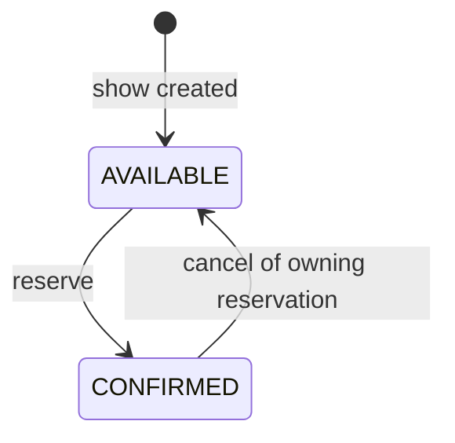
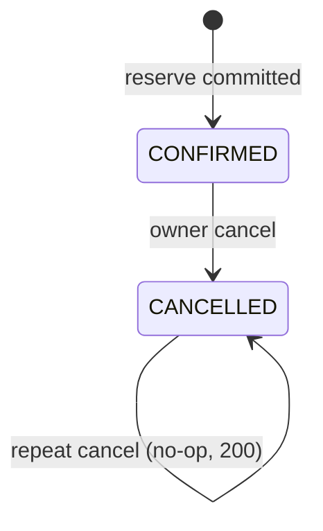

# 03 — Data Model

PostgreSQL 16 is the single source of truth. All constraints below are **load-bearing**: they are the
last line of defence if application logic is wrong, and they must not be relaxed for convenience.

## 1. Entity overview

```mermaid
erDiagram
  shows ||--o{ seats : has
  shows ||--o{ reservations : has
  shows ||--o{ user_show_quotas : has
  reservations ||--|{ reservation_seats : includes
  seats ||--o{ reservation_seats : "historically in"
  reservations |o--o{ seats : "currently holds"

  shows { uuid id PK; varchar name; timestamptz starts_at; int per_user_limit; int total_seats; timestamptz created_at }
  seats { bigint id PK; uuid show_id FK; varchar label; bigint price_paise; varchar status; uuid reservation_id FK }
  reservations { uuid id PK; uuid show_id FK; varchar user_id; varchar status; int seat_count; bigint total_paise; timestamptz created_at; timestamptz cancelled_at }
  reservation_seats { uuid reservation_id PK; bigint seat_id PK; uuid show_id; bigint price_paise; timestamptz released_at }
  user_show_quotas { uuid show_id PK; varchar user_id PK; int seats_held; int seat_limit }
  idempotency_records { uuid id PK; varchar user_id; varchar idem_key; varchar request_fingerprint; smallint response_status; text response_body; timestamptz created_at; timestamptz completed_at; timestamptz expires_at }
```

## 2. Identifier strategy

| Entity | Key | Generated by | Why |
|---|---|---|---|
| shows | `uuid` | Application: `UUID.randomUUID()` (v4, `SecureRandom`) | Public id, unguessable |
| reservations | `uuid` | Application: `UUID.randomUUID()` | Public id, unguessable (IDOR defence in depth), known before insert (needed for the stored response body) |
| idempotency_records | `uuid` | Application: `UUID.randomUUID()` | Internal |
| seats | `bigint GENERATED ALWAYS AS IDENTITY` | PostgreSQL | Compact, immutable, assigned in layout order → **the stable lock-ordering key** |
| reservation_seats | composite `(reservation_id, seat_id)` | — | Natural key |
| user_show_quotas | composite `(show_id, user_id)` | — | One serialization row per (show, user) |

UUID columns have no DB default; the application always supplies them. A missing id is a bug and
fails `NOT NULL`.

## 3. Executable DDL: `src/main/resources/db/migration/V1__baseline_schema.sql`

```sql
-- V1__baseline_schema.sql
-- Seat reservation service baseline schema. PostgreSQL 15+.
-- Do not edit after it has been applied anywhere; add V2__... instead.

CREATE TABLE shows (
    id              uuid         PRIMARY KEY,
    name            varchar(200) NOT NULL,
    starts_at       timestamptz  NOT NULL,
    per_user_limit  integer      NOT NULL,
    total_seats     integer      NOT NULL,
    created_at      timestamptz  NOT NULL DEFAULT now(),
    CONSTRAINT shows_name_not_blank_ck     CHECK (length(btrim(name)) > 0),
    CONSTRAINT shows_per_user_limit_ck     CHECK (per_user_limit BETWEEN 1 AND 10),
    CONSTRAINT shows_total_seats_ck        CHECK (total_seats BETWEEN 1 AND 10000)
);

CREATE TABLE seats (
    id              bigint       GENERATED ALWAYS AS IDENTITY PRIMARY KEY,
    show_id         uuid         NOT NULL REFERENCES shows (id),
    label           varchar(6)   NOT NULL,
    price_paise     bigint       NOT NULL,
    status          varchar(16)  NOT NULL DEFAULT 'AVAILABLE',
    reservation_id  uuid         NULL,
    CONSTRAINT seats_show_label_uk          UNIQUE (show_id, label),
    CONSTRAINT seats_id_show_uk             UNIQUE (id, show_id),
    CONSTRAINT seats_label_ck               CHECK (label ~ '^[A-Z]{1,3}[1-9][0-9]{0,2}$'),
    CONSTRAINT seats_price_ck               CHECK (price_paise BETWEEN 0 AND 100000000),
    CONSTRAINT seats_status_ck              CHECK (status IN ('AVAILABLE', 'HELD', 'CONFIRMED')),
    -- A seat is AVAILABLE exactly when it belongs to no reservation.
    CONSTRAINT seats_status_reservation_ck  CHECK ((status = 'AVAILABLE') = (reservation_id IS NULL))
);

-- Cancellation: find a reservation's current seats.
CREATE INDEX seats_reservation_idx ON seats (reservation_id) WHERE reservation_id IS NOT NULL;

CREATE TABLE reservations (
    id              uuid         PRIMARY KEY,
    show_id         uuid         NOT NULL REFERENCES shows (id),
    user_id         varchar(64)  NOT NULL,
    status          varchar(16)  NOT NULL,
    seat_count      integer      NOT NULL,
    total_paise     bigint       NOT NULL,
    created_at      timestamptz  NOT NULL DEFAULT now(),
    cancelled_at    timestamptz  NULL,
    CONSTRAINT reservations_id_show_uk      UNIQUE (id, show_id),
    CONSTRAINT reservations_status_ck       CHECK (status IN ('CONFIRMED', 'CANCELLED')),
    CONSTRAINT reservations_seat_count_ck   CHECK (seat_count BETWEEN 1 AND 10),
    CONSTRAINT reservations_total_ck        CHECK (total_paise >= 0),
    CONSTRAINT reservations_cancelled_ck    CHECK ((status = 'CANCELLED') = (cancelled_at IS NOT NULL))
);

-- A seat can only point at a reservation of the SAME show.
ALTER TABLE seats
    ADD CONSTRAINT seats_reservation_fk
    FOREIGN KEY (reservation_id, show_id) REFERENCES reservations (id, show_id);

CREATE TABLE reservation_seats (
    reservation_id  uuid         NOT NULL,
    seat_id         bigint       NOT NULL,
    show_id         uuid         NOT NULL,
    price_paise     bigint       NOT NULL,
    released_at     timestamptz  NULL,
    CONSTRAINT reservation_seats_pk          PRIMARY KEY (reservation_id, seat_id),
    CONSTRAINT reservation_seats_res_fk      FOREIGN KEY (reservation_id, show_id) REFERENCES reservations (id, show_id),
    CONSTRAINT reservation_seats_seat_fk     FOREIGN KEY (seat_id, show_id)        REFERENCES seats (id, show_id),
    CONSTRAINT reservation_seats_price_ck    CHECK (price_paise BETWEEN 0 AND 100000000)
);

-- Second, independent guard against double-selling: at most one ACTIVE (unreleased) link per seat.
CREATE UNIQUE INDEX reservation_seats_one_active_per_seat_uk
    ON reservation_seats (seat_id) WHERE released_at IS NULL;

CREATE TABLE user_show_quotas (
    show_id         uuid         NOT NULL REFERENCES shows (id),
    user_id         varchar(64)  NOT NULL,
    seats_held      integer      NOT NULL DEFAULT 0,
    seat_limit      integer      NOT NULL,
    CONSTRAINT user_show_quotas_pk           PRIMARY KEY (show_id, user_id),
    CONSTRAINT user_show_quotas_limit_ck     CHECK (seat_limit BETWEEN 1 AND 10),
    -- DB-enforced per-user limit: no transaction can commit a quota above the limit or below zero.
    CONSTRAINT user_show_quotas_held_ck      CHECK (seats_held BETWEEN 0 AND seat_limit)
);

CREATE TABLE idempotency_records (
    id                   uuid         PRIMARY KEY,
    user_id              varchar(64)  NOT NULL,
    idem_key             varchar(128) NOT NULL,
    request_fingerprint  varchar(64)  NOT NULL,
    response_status      smallint     NULL,
    response_body        text         NULL,
    created_at           timestamptz  NOT NULL DEFAULT now(),
    completed_at         timestamptz  NULL,
    expires_at           timestamptz  NOT NULL,
    CONSTRAINT idempotency_records_user_key_uk     UNIQUE (user_id, idem_key),
    CONSTRAINT idempotency_records_fp_ck           CHECK (request_fingerprint ~ '^[0-9a-f]{64}$'),
    CONSTRAINT idempotency_records_key_ck          CHECK (idem_key ~ '^[A-Za-z0-9_.:-]{1,128}$'),
    CONSTRAINT idempotency_records_status_ck       CHECK (response_status IS NULL OR response_status BETWEEN 200 AND 499),
    -- response_status, response_body, completed_at are set together (finalize step).
    CONSTRAINT idempotency_records_completion_ck   CHECK (
        (response_status IS NULL) = (completed_at IS NULL)
        AND (response_status IS NULL) = (response_body IS NULL)
    ),
    CONSTRAINT idempotency_records_expiry_ck       CHECK (expires_at > created_at)
);

CREATE INDEX idempotency_records_expires_idx ON idempotency_records (expires_at);
```

Notes:

- `varchar` (not `char`) everywhere, so Hibernate `ddl-auto=validate` passes for `ShowEntity`.
- All money columns are `bigint` paise. No `numeric`, `real`, `double precision`, or `money`.
- No triggers and no stored procedures. Every rule lives in a constraint or in the transaction
  scripts in `04`, which keeps behaviour explicit and testable.
- Seat lookups by show use the `seats_show_label_uk` index (leading column `show_id`).

## 4. Seat state machine



`HELD` is a legal value of `seats.status` (so the invariant `available + held + confirmed = total` is
well-defined), but v1 has no transition into or out of it.

| From | To | Trigger | Guard (SQL predicate) | Side effects (same tx) |
|---|---|---|---|---|
| — | AVAILABLE | create show | insert | — |
| AVAILABLE | CONFIRMED | reserve | row locked `FOR UPDATE`; `status = 'AVAILABLE'` in `UPDATE ... WHERE` | `reservation_id := R`; insert `reservation_seats(R, seat)`; quota `+n` |
| CONFIRMED | AVAILABLE | cancel R | row locked; `reservation_id = R AND status = 'CONFIRMED'` | `reservation_id := NULL`; `reservation_seats.released_at := now()`; quota `−n` |

Illegal transitions (must be impossible): CONFIRMED→CONFIRMED with a different reservation; any
transition of a seat by a reservation it doesn't belong to; AVAILABLE with a non-null
`reservation_id`.

## 5. Reservation state machine



| From | To | Guard | Notes |
|---|---|---|---|
| — | CONFIRMED | all seats locked and AVAILABLE; quota permits | Inserted in its final state; never visible half-built (same tx) |
| CONFIRMED | CANCELLED | caller = `user_id`; row locked `FOR UPDATE`; `UPDATE ... WHERE status = 'CONFIRMED'` | Terminal |
| CANCELLED | * | — | No transitions out; reservations are never deleted |

## 6. Idempotency design

### 6.1 Scope

Uniqueness: **`(user_id, idem_key)`**. A key belongs to one user, and two users with the same key
string are independent. Within a user, a key binds to exactly one canonical reserve request (target
show + seat set). Reusing a key for a different show or a different seat set returns
`409 IDEMPOTENCY_KEY_REUSED`.

### 6.2 Canonicalization and fingerprint

The fingerprint is computed **after** validation, from the validated command (never from raw bytes):

`v1|RESERVE|show=<showId as lowercase canonical UUID>|seats=<labels sorted ascending (String natural order), comma-joined>`

Example: `v1|RESERVE|show=7f1c2b9e-3a7d-4a51-9a1f-0f3f3c1c2d10|seats=A1,A2`

`request_fingerprint = lowercase hex(SHA-256(UTF-8(canonical string)))`. The `v1|` prefix lets the
canonical form evolve without false matches.

### 6.3 Storage lifecycle

1. **Claim** (first statement of the transaction):
   `INSERT ... ON CONFLICT (user_id, idem_key) DO NOTHING RETURNING id`.
2. **Finalize** (last statement before commit): set `response_status`, `response_body` (the exact
   JSON bytes sent), and `completed_at`.
3. The commit makes the claim, the finalize, and the business effect visible atomically. **A
   committed record always has a response** (reconciliation R7 checks this). There is no persistent
   `IN_PROGRESS` state, so a crash can never leave a stuck key.

Concurrent same-key handling is specified in `04` §5.

### 6.4 Retention

- `expires_at = created_at + APP_IDEMPOTENCY_RETENTION` (default `PT24H`).
- Keys are honored for **at least** the retention period. Expired records that haven't been deleted
  yet are still honored (lookup doesn't filter on `expires_at`).
- `IdempotencyCleanupJob` runs every 15 minutes:

```sql
DELETE FROM idempotency_records
WHERE id IN (
    SELECT id FROM idempotency_records
    WHERE expires_at < now()
    ORDER BY expires_at
    LIMIT 5000
    FOR UPDATE SKIP LOCKED
);
```

  It repeats while a batch deletes 5,000 rows (max 20 batches per run).
- Deleting a record doesn't affect the reservation it produced.

## 7. Invariants

### 7.1 Database-enforced (these hold regardless of application bugs)

| ID | Invariant | Mechanism |
|---|---|---|
| D-1 | A seat belongs to at most one reservation at a time | Single `seats.reservation_id` column |
| D-2 | `status = 'AVAILABLE'` ⇔ `reservation_id IS NULL` | `seats_status_reservation_ck` |
| D-3 | A seat's reservation belongs to the same show | Composite FK `seats_reservation_fk` |
| D-4 | At most one active `reservation_seats` link per seat | Partial unique index |
| D-5 | `reservation_seats` links a seat and reservation of the same show | Two composite FKs |
| D-6 | `0 ≤ seats_held ≤ seat_limit` per (show, user) | `user_show_quotas_held_ck` |
| D-7 | One idempotency record per (user, key) | `idempotency_records_user_key_uk` |
| D-8 | Seat labels are unique per show | `seats_show_label_uk` |
| D-9 | Money is integral and non-negative | `bigint` + CHECKs |
| D-10 | Reservation `CANCELLED` ⇔ `cancelled_at` set | `reservations_cancelled_ck` |
| D-11 | Each seat has exactly one status from a closed set | `NOT NULL` + `seats_status_ck` |

Consequence of D-11: for any show, `count(AVAILABLE) + count(HELD) + count(CONFIRMED) = count(seats)`
holds **by construction** in any single snapshot. `GET /shows/{id}` derives counts from one
statement, so a response can never violate the invariant.

### 7.2 Transaction-level invariants (maintained by the scripts in `04`, verified by reconciliation)

| ID | Invariant | Maintained by |
|---|---|---|
| X-1 | `count(seats WHERE show_id = S) = shows.total_seats` | Show and seats are inserted in one tx; seats are never inserted or deleted afterwards |
| X-2 | A `CONFIRMED` reservation R has exactly `R.seat_count` seats with `reservation_id = R`, and exactly that many active `reservation_seats` | Reserve inserts/updates all n in one tx, with row-count assertions |
| X-3 | A `CANCELLED` reservation has 0 seats pointing at it and 0 active links | Cancel releases all of them in one tx, with row-count assertions |
| X-4 | `user_show_quotas.seats_held` = Σ `seat_count` of the user's `CONFIRMED` reservations in that show | The quota row is updated in the same tx as every allocation/release, under its lock |
| X-5 | `HELD` count = 0 (v1) | No code path writes `HELD` |
| X-6 | Every committed idempotency record has a response | Finalize precedes commit in every committing path |

### 7.3 Reconciliation queries

Each query returns the violating rows; an empty result means the invariant holds. They are used by
the integration and concurrency tests (asserted empty after each concurrency test) and as manual
runbook queries in production (05 §6).

```sql
-- R1: seat count per show matches total_seats (X-1)
SELECT s.id FROM shows s LEFT JOIN seats st ON st.show_id = s.id
GROUP BY s.id, s.total_seats HAVING count(st.id) <> s.total_seats;

-- R2: HELD must be zero in v1 (X-5)
SELECT id FROM seats WHERE status = 'HELD';

-- R3: every seat with a reservation points to a CONFIRMED reservation
SELECT st.id FROM seats st JOIN reservations r ON r.id = st.reservation_id
WHERE r.status <> 'CONFIRMED';

-- R4: CONFIRMED reservations hold exactly seat_count seats; CANCELLED hold none (X-2, X-3)
SELECT r.id FROM reservations r LEFT JOIN seats st ON st.reservation_id = r.id
GROUP BY r.id, r.status, r.seat_count
HAVING (r.status = 'CONFIRMED' AND count(st.id) <> r.seat_count)
    OR (r.status = 'CANCELLED' AND count(st.id) <> 0);

-- R5: quota counters equal actual confirmed seats (X-4), checked in BOTH directions:
-- a quota row with the wrong count, and confirmed reservations with no quota row at all.
SELECT coalesce(q.show_id, a.show_id) AS show_id, coalesce(q.user_id, a.user_id) AS user_id
FROM user_show_quotas q
FULL OUTER JOIN (
    SELECT show_id, user_id, sum(seat_count) AS held
    FROM reservations WHERE status = 'CONFIRMED' GROUP BY show_id, user_id
) a ON a.show_id = q.show_id AND a.user_id = q.user_id
WHERE coalesce(q.seats_held, 0) <> coalesce(a.held, 0);

-- R6: active links agree with seats.reservation_id
SELECT rs.seat_id FROM reservation_seats rs JOIN seats st ON st.id = rs.seat_id
WHERE rs.released_at IS NULL AND st.reservation_id IS DISTINCT FROM rs.reservation_id
UNION ALL
SELECT st.id FROM seats st
LEFT JOIN reservation_seats rs ON rs.seat_id = st.id AND rs.released_at IS NULL
WHERE st.reservation_id IS NOT NULL AND rs.reservation_id IS DISTINCT FROM st.reservation_id;

-- R7: committed idempotency records always carry a response (X-6)
SELECT id FROM idempotency_records WHERE response_status IS NULL;
```

Uncommitted rows are invisible to other sessions, so a non-empty R7 result means a committed record
without a response, which is a bug.

## 8. Stored counters policy

- **No show-level counters** (`available_count` and so on). They would duplicate values that D-11
  already derives, and they would create a single hot row that serializes every reservation for a
  show.
- **One counter exists: `user_show_quotas.seats_held`.** The quota row is required anyway as the
  per-(show, user) serialization point. Storing the count on it lets a DB CHECK (D-6) enforce the
  limit even if application logic regresses. It is updated only in the same transaction as the seat
  transitions it summarizes, while holding the row lock (X-4), and R5 reconciles it against the
  seat rows.
- Repair procedure (manual, only if R5 ever fires): in a transaction, lock the quota row, set
  `seats_held` to the value R5 recomputes, and record the incident.

## 9. Flyway migration strategy

- Location `classpath:db/migration`; naming `V<n>__<snake_case_description>.sql`; start at `V1`.
- Migrations are applied at application startup (`spring.flyway.enabled=true`) before the web server
  accepts traffic.
- `spring.flyway.validate-on-migrate=true`, `spring.flyway.clean-disabled=true`,
  `spring.flyway.baseline-on-migrate=false`.
- `spring.jpa.hibernate.ddl-auto=validate`: Hibernate never changes the schema.
- Forward-only: never edit an applied migration; changes go in a new version.
- Flyway uses the application DataSource. The connection-level `statement_timeout` (35 s, ADR-022) is fine for
  V1 (DDL on empty tables). Future large data migrations must start with
  `SET LOCAL statement_timeout = 0`.
- Test MIG-01 (`06`) starts from an empty Testcontainers database and asserts that V1 applies and
  Hibernate validation passes. MIG-02 asserts that a second startup is a no-op.
