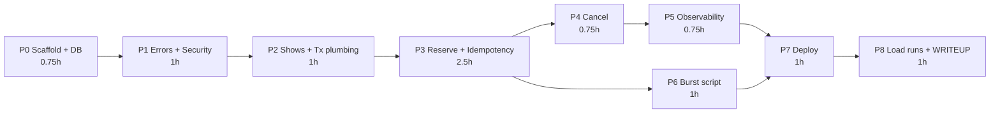

# 08 — Implementation Plan (one-day budget)

Priority order when time runs short: **correctness → clean startup → live deployment → load evidence
→ observability → documentation polish.** Never trade away a guarantee in `04` to save time.

Total budget: about 9–10 focused hours. The estimates are planning aids, not commitments.

## 1. Phase overview and dependencies

## 2. Phases

### P0: Scaffold, database, health (≈ 0.75 h)

Tasks:
1. `git init`; `.gitignore` (`target/`, `.env`, IDE files). Create the Spring Initializr project
   (Boot 3.5.x latest patch, Java 21, Maven; dependencies per `01` §1.2) and commit the Maven Wrapper.
2. Write `V1__baseline_schema.sql` exactly as in `03` §3.
3. Write `application.yml`, `application-local.yml`, and `application-prod.yml` per `07` §4.
4. Add `ShowEntity` and `ShowJpaRepository` (needed for `ddl-auto=validate`).
5. Add `AbstractPostgresIT` (Testcontainers `postgres:16-alpine`, `@ServiceConnection`).
6. Add `Dockerfile`, `.dockerignore`, `docker-compose.yml`, and `.env.example`.

Done when: MIG-01..MIG-03 pass, and `docker compose up --build` reaches `/readyz` 200.

### P1: Error model and security (≈ 1 h)

Tasks:
1. `ErrorCode`, the `ApiException` hierarchy, and `GlobalExceptionHandler` (Problem Details with
   `code`, `requestId`, `retryable`), plus handlers for validation, malformed JSON, unknown routes,
   405, and 415.
2. `RequestIdFilter`.
3. `JwtConfig` (HS256 decoder + validators), `RolesClaimConverter`, `SecurityConfig` (stateless,
   CSRF disabled for the bearer API, rules from `02` §1), and the problem-JSON entry point and
   access-denied handler.
4. `StartupChecks` (JWT secret and admin key rules), the `TestTokens` helper, and
   `scripts/MintToken.java`.
5. The demo token endpoint: `TokenIssuer` (`NimbusJwtEncoder`, HS256) and `AuthController`
   (`POST /auth/token`, ADMIN gated by a constant-time `X-Admin-Key` check; ADR-021).

Done when: UT-04, UT-07, UT-08, UT-09, AUTH-01..AUTH-13, and MIG-04 pass.

### P2: Shows and transaction plumbing (≈ 1 h)

Tasks:
1. DTOs with Bean Validation; `RequestFingerprinter`; UT-01..UT-03.
2. `TxExecutor` and `DbErrorClassifier` (UT-05, UT-06). Every write path needs these.
3. `ShowService.create` (JPA show + JDBC batch seat insert) and `GET /shows/{id}` with derived counts.

Done when: IT-SHOW-01..04 pass.

### P3: Reserve and idempotency (test-first, ≈ 2.5 h) ★ critical path

The order is mandatory: write the concurrency tests **before** the implementation, and watch them
fail first.

1. **Checkpoint T1 (tests first):** write CT-01..CT-05, IT-RES-01..12, and IT-IDEM-01..07 and 09
   against the API contract. Commit them as failing tests (`@Disabled` is not allowed).
2. `IdempotencyService` and `IdempotencyJdbcRepository` (claim/lookup/finalize; assert an active
   transaction).
3. Repositories: `SeatJdbcRepository` (resolve, lockByIdsOrdered, confirm), `QuotaJdbcRepository`
   (ensure, lockForUpdate, increment), and `ReservationJdbcRepository` (insert, insertLinks). Use the
   SQL from `04` §4 **verbatim** (parameter names may differ).
4. `ReservationService.reserve`, implementing S1–S9 with row-count assertions; the `ReserveOutcome`
   sealed type; controller mapping (201 / stored status + `Idempotent-Replayed`).
5. **Checkpoint T2:** CT-01..CT-05, IT-RES-*, and IT-IDEM-* are green. Run the CT suite 5 times in a
   row to shake out flakiness:
   `for i in 1 2 3 4 5; do ./mvnw -q verify -Dit.test='*ConcurrencyIT' || break; done`.
6. IT-FAIL-01 (lock timeout → 503, full rollback).

Done when: T2 passes in 5 of 5 runs, with no deadlocks.

### P4: Cancel (≈ 0.75 h)

1. Tests first: IT-CAN-01..07, CT-06, CT-07.
2. `CancellationService` per `04` §6 (C1–C8), with assertions.

Done when: all of the above pass and R1–R7 return no rows after each test.

### P5: Observability (≈ 0.75 h)

1. `ReservationMetrics` (the five custom meters in `05` §4.1), registered eagerly and incremented
   after commit.
2. `ObservabilityDataSourceConfig` + `SeatGaugeCollector` (per-show seats gauge read at scrape time
   over the 2-connection observability pool, ADR-023) and `IdempotencyCleanupJob` (IT-IDEM-08).
3. MDC enrichment (`userRef`, `idemKeyRef`, …) and the log events in `05` §7.
4. Actuator configuration and probes.

Done when: OBS-01..OBS-10 pass (IT-FAIL-02 / OBS-03 may be tagged `@Tag("slow")`).

### P6: Burst script (≈ 1 h; can run in parallel with P4/P5 after P3)

1. `scripts/BurstTest.java` per `06` §7: tokens from `POST /auth/token`, the 4 scenarios with
   reconciliation (GET counts and the per-show gauge), the 0 × 5xx assertion,
   ambiguity resolution, the output table, the `SUMMARY` JSON, and the exit code.
2. Run it against local Compose: `--scenario all`, then `pool-burst --requests 20000`.

Done when: the local runs (including the 20k `pool-burst`) print `ASSERTIONS: PASS` with 0 × 5xx, and
their raw output is saved to
`docs/evidence/local-<date>.txt` (git-tracked; real output only).

### P7: Deployment (≈ 1 h)

1. Create the Render PostgreSQL instance and Web Service (`07` §7.2) and set the env vars, including
   `APP_AUTH_ADMIN_KEY`.
2. Deploy, then run items 3, 5–11 and 14 of the checklist in `07` §11.
3. Run the burst against the deployed URL: `--scenario all --concurrency 200` (L-3), then the 20k
   `pool-burst` at concurrency 300 (L-4, mandatory). Save the output to
   `docs/evidence/deployed-<date>.txt`. If L-4 shows any 5xx, resize the plan or pool (or adopt the
   fast-path fallback in `04` §12) and rerun.

Done when: the public `/readyz` returns 200 and both deployed runs print `ASSERTIONS: PASS` with
0 × 5xx.

### P8: Load evidence and write-up (≈ 1 h)

1. Run L-1..L-4 as far as the environment allows, and capture the machine/plan details.
2. Fill in `WRITEUP.md` from `09`, using **only** observed numbers. Add the deployed URL to the
   README.
3. Work through the final acceptance checklist (§5).

## 3. Deployment checkpoints

| Checkpoint | When | Gate |
|---|---|---|
| D1 | After P0 | `docker compose up --build` → `/readyz` 200 from a clean clone (`git clone` into a temp dir) |
| D2 | After P3 | Push and deploy early (even before cancel) to surface hosting issues: the DB URL format, memory, `PORT` |
| D3 | After P5 | Redeploy; `/actuator/prometheus` serves the custom metrics; logs are JSON |
| D4 | After P7 | The deployed burst passes |

Deploying early at D2 is deliberate: hosting problems are the most likely cause of a last-minute
failure.

## 4. Risk register

| # | Risk | Likelihood | Impact | Mitigation / fallback |
|---|---|---|---|---|
| R-1 | Flaky concurrency tests | Medium | High | Latch start gates, generous timeouts, 5 consecutive runs; fix root causes, never loosen assertions |
| R-2 | Hosted free tier sleeps or is too small | High | Medium | Paid starter instance for the evaluation window; document it; warm up first |
| R-3 | DB `max_connections` too low on the hosted plan | Medium | Medium | Lower `DB_POOL_MAX_SIZE` (remember the +2 observability connections), or pick a bigger plan |
| R-4 | Virtual-thread pinning or unexpected blocking | Low | Medium | Fall back to `spring.threads.virtual.enabled=false` with Tomcat `threads.max=200` |
| R-5 | PgJDBC doesn't run the multi-statement `connection-init-sql` | Low | Medium | JDBC `options` URL fallback (`07` §4.1); IT-FAIL-01 verifies `SHOW lock_timeout` |
| R-6 | Hibernate validation mismatch | Medium | Low | Entity column definitions mirror the DDL; MIG-01 catches it |
| R-7 | Docker unavailable for Testcontainers | Low | High | Docker is a documented prerequisite; unit tests still run without it |
| R-8 | The 20k burst produces any 5xx on the hosted plan | High | **High** (fails the assignment's bar) | Overload queues (ADR-022); choose the plan by measurement with L-4; scale the instance/DB or tune the pool; fast-path fallback (`04` §12); rerun until 0 × 5xx |
| R-9 | Running out of time | Medium | High | Cut order: IT-FAIL-02 → dashboard text → latency percentiles in burst output. Never cut: CT-01..07, cancel, required metrics, deployment |
| R-10 | Spring Boot 3.5 OSS support has ended by implementation time | Medium | Low | Still mandated (3.x); note it in WRITEUP |
| R-11 | The shared admin key is misused | Low | Low (demo data) | Share privately; rotate after the evaluation. The JWT signing secret is never shared (ADR-021) |
| R-12 | Evaluator clients time out while the burst queues | Medium | Medium | Size the plan so p99 stays well below common client timeouts; report the measured percentiles |

## 5. Final acceptance checklist

- [ ] `./mvnw verify` is green from a fresh clone (Docker running).
- [ ] CT-01..CT-07 are green, with no deadlocks.
- [ ] `docker compose up -d --build` → `/readyz` 200, with no manual steps.
- [ ] All endpoints match `02` (paths, codes, headers, bodies), with Problem Details everywhere.
- [ ] Identity comes only from the JWT; a body `userId` is rejected.
- [ ] Money is `long` paise end-to-end; no `double`/`float`/`BigDecimal` in money paths.
- [ ] The metrics in `05` §4.1 are present, with no unbounded labels.
- [ ] `/livez` is independent of the DB; `/readyz` fails without the DB.
- [ ] The deployed URL is live and the `07` §11 checklist is done.
- [ ] Burst evidence (local + deployed, including the deployed 20k run) is committed as raw output,
  with 0 × 5xx in every run.
- [ ] `WRITEUP.md` is complete, with honest numbers and the AI-assistance disclosure; the README has
  the URL.
- [ ] No secrets in Git (`git grep` check).
